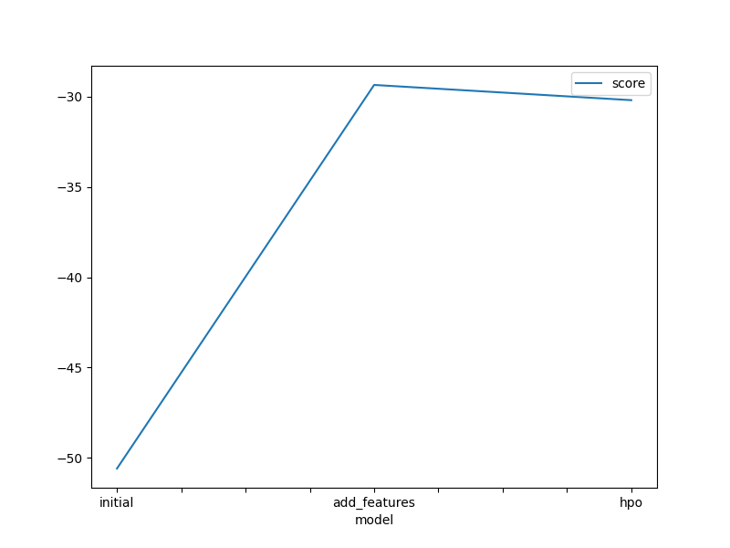

# Report: Predict Bike Sharing Demand with AutoGluon Solution
#### Jorge Espinoza

## Initial Training
### What did you realize when you tried to submit your predictions? What changes were needed to the output of the predictor to submit your results?
I needed to put negative values as 0. Otherwise, Kaggle shows an error in the results table.

### What was the top ranked model that performed?
WeightedEnsemble_L3 for the three cases: initial, add features and new hyperparameters.

## Exploratory data analysis and feature creation
### What did the exploratory analysis find and how did you add additional features?
The data depends on time but linear time does not give too much information. Bike sharing has some peaks depending on the hour of day, day of week and month. That makes sense because of the case we are studying.

### How much better did your model preform after adding additional features and why do you think that is?
The Kaggle score decreased in 57.6%. This improvement could be due to the additional features which gives more information about the behavior of the bike sharing demand. Previously, we considered linear time, which does not give detailed information because of the periodic behavior. On the other hand, hour of day, day of week and month gives more significant information because those features impacts on bike sharing demand.

## Hyper parameter tuning
### How much better did your model preform after trying different hyper parameters?
The Kaggle score decreased in 15% compared to adding additional features and decreased 64% compared to the original model.

### If you were given more time with this dataset, where do you think you would spend more time?
Trying to make a deeper exploratory data analysis to understand the data better. I think I missed something important there.

### Create a table with the models you ran, the hyperparameters modified, and the kaggle score.
|model|eval_metric|time_limit|presets|score
|--|--|--|--|--|
|initial|root_mean_squared_error|600|best_quality|1.78876
|add_features|root_mean_squared_error|600|best_quality|0.75821
|hpo|root_mean_squared_error|600|best_quality|0.64443

### Create a line plot showing the top model score for the three (or more) training runs during the project.

### Create a line plot showing the top kaggle score for the three (or more) prediction submissions during the project.

## Summary
We used AutoGluon to find a model that fits well with a Bike Sharing Demand data. The data contains some features that could be useful or not, so we discard two of them which did not dive value.

We made the fit and found that the best model was WeightedEnsemble_L3. But we used AutoGluon with raw data, without analysing data first.

We added some features which could add value to the model: hour of day, day of week and month. The reason those features could add value is that the linear time could be related to the increase or decrease of bike sharing demand, but it is just a long term variation. Using a bike depends on the weather, for example, of if day is weekend or not.

So, with that features, the model fits better accorging to Kaggle score. Adding more time to AutoGluon helped to improve the model accorging to Kaggle score.